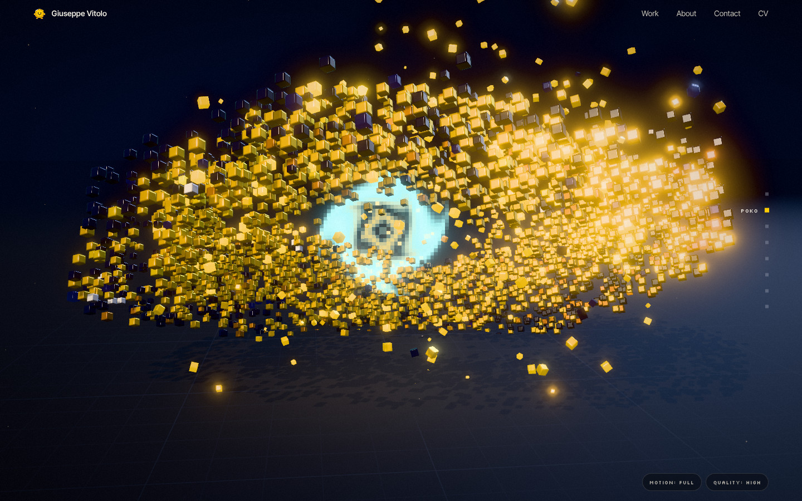

# Poko Genesis — Giuseppe Vitolo's portfolio

A cinematic, scroll-driven portfolio. Poko, the pixel-art coin mascot of
[Pokoin](https://pokoin.com), wakes up as a voxel sculpture, comes apart into
4 096 GPU-animated cubes, builds a portal, then a Pokoin card, a CardRail
scanning rack and a systems diagram, and finally reassembles under the name it
spells in voxels. Every frame is a pure function of the scroll position, so the
whole journey plays backward exactly.

Live (current production): https://gvitolo.vercel.app/



- Walkthrough video: [`docs/media/poko-genesis-walkthrough.mp4`](docs/media/poko-genesis-walkthrough.mp4)
- Screenshot gallery: [`docs/media/gallery/`](docs/media/gallery/) (desktop), [`docs/media/mobile/`](docs/media/mobile/)
- Engineering guide: [`docs/POKO_GENESIS_ENGINEERING.md`](docs/POKO_GENESIS_ENGINEERING.md)
- Performance report: [`docs/PERFORMANCE_REPORT.md`](docs/PERFORMANCE_REPORT.md)
- Research on Lusion's public techniques: [`docs/research/`](docs/research/)
- Asset provenance and licences: [`docs/ASSET_PROVENANCE.md`](docs/ASSET_PROVENANCE.md)
- Deployment and rollback: [`docs/DEPLOYMENT.md`](docs/DEPLOYMENT.md)

## Stack

SolidJS 1.9 · TypeScript · Vite 8 · three.js r186 (WebGL2, custom GLSL, GPGPU
compute pass, one instanced draw for all voxels) · Blender 5.1 via `bpy` for the
rigged character and its 9 actions · gltfpack/meshopt · Vitest · Playwright.

## Develop

```sh
npm ci
npm run dev                 # http://127.0.0.1:5173/
npm test && npm run build && npm run test:e2e
```

Requires Node 22.18+. Pages are prerendered to `dist/` and work without
JavaScript or WebGL; the 3D experience loads after the content.

## Character pipeline

```sh
npm run poko:voxels                      # pixel art → voxels (TypeScript)
pip install bpy==5.1.2                   # or use `blender -b -P`
python blender/scripts/build_poko.py     # .blend, rig, actions, raw GLB, renders
npm run poko:pack                        # meshopt-compress + validate the GLB
```

## Content

Copy and project facts are in `src/content/`. CV: `npm run cv:sync` downloads
the English CV from [gvitolocs/myresume](https://github.com/gvitolocs/myresume)
into `public/cv.pdf`. Figures keep the caveats documented in that repository
(see the case-study pages).
