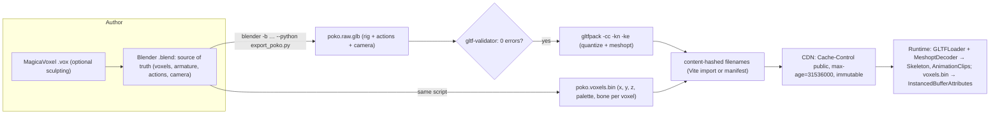

# Asset Production Workflow: Blender → glTF → web (with a voxel side-channel)

> Research for POKO GENESIS, written 2026-10-09. Part of the Lusion study ([overview](./LUSION_DEEP_TECHNICAL_ANALYSIS.md)).
> The Blender manual page (docs.blender.org) was blocked from this sandbox, so its **source** was read instead: `docs/blender_docs/scene_gltf2.rst` in `KhronosGroup/glTF-Blender-IO` (commit `6e6990a`, 2026-10-01, add-on version **5.3.36**, Apache-2.0). Operator property names come from that repo's `addons/io_scene_gltf2/__init__.py`.
> Compression tool docs were read from npm packages: `gltfpack@1.3.0` (MIT), `@gltf-transform/cli@4.5.1` (MIT), `gltf-validator@2.0.0-dev.3.10` (Apache-2.0). Extension status was read from `KhronosGroup/glTF` extension READMEs. The MagicaVoxel spec is from `ephtracy/voxel-model` (MIT).
> All scripts here are **original illustrations**, not production code.

---

## 1. Pipeline overview



The key design decision is that **voxels are not shipped as a mesh**. The glb carries the skeleton, animation clips and camera path, which glTF is good at. The voxels travel as a compact binary list that becomes instanced attributes at runtime (WEBGL_RENDERING_TECHNIQUES §1–2). This mirrors Lusion's documented habit of shipping baked, quantised custom data where it beats general formats (16-bit `ArrayBuffer`s, 2019 case study, via search excerpt).

---

## 2. Blender as the source of truth

### 2.1 Scene conventions

- **Units and axes.** Blender is Z-up and glTF is Y-up. The exporter's `+Y Up` option (`export_yup`, default `True`) converts. Keep Blender units = metres and 1 voxel = 0.1 m (or 1 unit), and *apply* scale and rotation (Ctrl-A) on all objects before rigging.
- **Collections.** `POKO_RIG` (armature), `POKO_VOXELS` (voxel mesh, or one object per part), `CAMERA_PATH` (camera + target empty), `SCULPT_<project>` (one per project formation).
- **Frame rate.** Fix the scene FPS (e.g. 30) and author every action at that rate. Runtime scrubbing uses seconds, so the fps only affects sampling density.
- **Names are API.** Bone names, action names and NLA track names become glTF node and animation names that runtime code looks up. Freeze them.

### 2.2 Armature and rigid vertex-group skinning

A voxel character deforms **rigidly**: each voxel belongs to exactly one bone (head, ear, arm…). In Blender:

1. Parent the voxel mesh to the armature with an **Armature modifier**.
2. For each part, select its voxels and assign them to the bone's vertex group with **weight 1.0**. Make sure every vertex has exactly one group (*Weights → Limit Total = 1*, then *Normalize All*).
3. Mark control and IK bones as non-deform. Exporting with **Export Deformation Bones Only** (`export_def_bones=True`) then keeps the glTF skeleton minimal. The manual notes that "animation for deformation bones are baked" in this mode, which is what we want when IK or constraints drive them.

glTF skinning stores `JOINTS_0` / `WEIGHTS_0` as 4-component vectors. A rigid voxel becomes `[b, 0, 0, 0]` / `[1, 0, 0, 0]`. The manual warns that the **Bone influences** setting (`export_influence_nb`, default 4) "may appear incorrectly in many viewers with value different to 4 or 8". Leave it at 4.

At runtime POKO doesn't need the skinned voxel mesh at all. It needs the **bone hierarchy and animation** (from glTF) and, per voxel, `(boneIndex, localPosition)`, which the export script writes to `voxels.bin` (§2.5). The alternative is a custom attribute: the exporter writes mesh attributes "when the name starts with underscore" (`export_attributes=True`). three's `GLTFLoader` maps unknown attribute names to lowercase (`attributeName.toLowerCase()`), so a Blender integer attribute `_BONE` arrives as `geometry.attributes._bone`.

### 2.3 Actions and NLA (from the manual source)

- **Actions mode (default, `export_animation_mode='ACTIONS'`).** "An action will be exported if it is the active action on an object, or it is stashed to an NLA track … Actions which are **not** associated with an object in one of these ways are **not exported**. If you have multiple actions you want to export, make sure they are stashed!" The glTF animation name is the action name, unless you rename the NLA track.
- **Blender 4.4 slotted actions.** "Now, tracks are merged by the action they are using, and not by their name." The newer `export_merge_animation` option defaults to `'ACTION'`.
- **NLA Tracks mode.** Each NLA track becomes an independent glTF animation. Use it if you rely on strip modifiers.
- **Scene mode.** Bakes what the viewport shows into one animation.
- Only object TRS, pose bones and shape-key values animate. "Animation of other properties, like physics, lights, or materials, will be ignored" (except through the experimental *Animation Pointer*).

POKO action plan:

| Action | Use at runtime |
|---|---|
| `idle` | looped on the time layer (disabled under reduced motion) |
| `wave` | scrubbed by intro progress |
| `brace` | pose before disintegration |
| `land` | pose after reconstruction |
| `cam_path` | (on the camera) scrubbed by global progress |

Push each one down or stash it to its own NLA track. Turn on *Set all glTF Animation starting at 0* so `clip.duration` maps cleanly to progress.

### 2.4 Colour attributes

Blender's *Color Attributes* (byte or float; point or face-corner domain) export as glTF `COLOR_0` according to **Use Vertex Color** (`export_vertex_color`):

| Value | Behaviour |
|---|---|
| `MATERIAL` (default) | export only when the material node tree uses the attribute as a Base Color multiplier |
| `ACTIVE` | export the active colour attribute even if unused |
| `NAME` | export the colour attribute with the given name |
| `NONE` | do not export colours |

Related options: *Export all vertex colors* (adds `COLOR_1`, …) and *Export active vertex color when no material* (default on). In three, `COLOR_0` becomes `geometry.attributes.color` and needs `material.vertexColors = true`. glTF defines vertex colours as linear, so verify the round trip with a known swatch.

**Recommendation for a pixel-art palette:** don't rely on colour attributes for final colours. Store a **palette index** per voxel (an integer `_PAL` attribute, or a column in `voxels.bin`) and look it up in a 256×1 `RGBA8` `DataTexture` with `NearestFilter`. This gives exact, themeable colours (alternate palettes per project or season) and survives quantisation unchanged.

### 2.5 Headless export script (`bpy`)

```python
# tools/export_poko.py — original illustration.
# Run: blender --background poko.blend --python-exit-code 1 --python tools/export_poko.py -- --out dist/models
import bpy, sys, os, struct, argparse

argv = sys.argv[sys.argv.index("--") + 1:] if "--" in sys.argv else []
ap = argparse.ArgumentParser(); ap.add_argument("--out", required=True); args = ap.parse_args(argv)
os.makedirs(args.out, exist_ok=True)

def select_collections(*names):
    bpy.ops.object.select_all(action="DESELECT")
    for n in names:
        for ob in bpy.data.collections[n].all_objects:
            ob.select_set(True)

# 1) Rig + actions + camera → glb (voxel mesh excluded: voxels go to a binary side-channel)
select_collections("POKO_RIG", "CAMERA_PATH")
bpy.ops.export_scene.gltf(
    filepath=os.path.join(args.out, "poko.raw.glb"),
    export_format="GLB", use_selection=True, export_yup=True, export_apply=True,
    export_texcoords=False, export_normals=True, export_tangents=False,
    export_materials="NONE",                     # rig/camera file: no materials needed
    export_image_format="NONE", export_vertex_color="NONE",
    export_skins=True, export_def_bones=True, export_influence_nb=4, export_rest_position_armature=True,
    export_animations=True, export_animation_mode="ACTIONS", export_force_sampling=True,
    export_frame_step=1, export_optimize_animation_size=True, export_morph=False,
    export_cameras=True, export_lights=False, export_extras=True,
    export_draco_mesh_compression_enable=False,   # compress later with gltfpack (meshopt also compresses animation)
)

# 2) Voxels → compact binary: header + per voxel (x,y,z,pal,bone) as uint8
mesh_ob = bpy.data.objects["POKO_VOXELS"]
arm = mesh_ob.find_armature()
bone_index = {b.name: i for i, b in enumerate(b for b in arm.data.bones if b.use_deform)}
me = mesh_ob.data
pal = me.attributes.get("_PAL")              # integer attribute, POINT domain, authored or imported from .vox
records = []
# assumption: one voxel = one point in a separate "voxel centres" mesh; adapt if voxels are cubes
for v in me.vertices:
    if not v.groups:
        raise RuntimeError(f"voxel vertex {v.index} has no bone group")   # fail CI instead of guessing
    g = max(v.groups, key=lambda g: g.weight)
    bone = bone_index[mesh_ob.vertex_groups[g.group].name]
    x, y, z = (int(round(c / 0.1)) for c in v.co)            # grid units (0.1 m voxels), Blender Z-up
    records.append((x + 128, z + 128, -y + 128, pal.data[v.index].value if pal else 0, bone))  # to Y-up
with open(os.path.join(args.out, "poko.voxels.bin"), "wb") as f:
    f.write(struct.pack("<4sHH", b"PKVX", 1, len(records)))   # magic, version, count
    for r in sorted(records):                                  # sorted → better gzip/brotli ratio
        f.write(struct.pack("<5B", *r))
print("exported", len(records), "voxels,", len(bone_index), "deform bones")
```

Notes:
- `--python-exit-code 1` makes Blender exit non-zero when the script raises, so CI fails loudly.
- Property names match the exporter on `main` (add-on 5.3.36). Older Blender releases lack some of them, e.g. `export_merge_animation` and the meshopt options. List what your build supports with `bpy.ops.export_scene.gltf.get_rna_type().properties.keys()` and pin the Blender version in CI.
- `export_materials="NONE"` suits a rig-only file. The manual: "Does not export materials. Primitives are merged, losing material slot information". Use `"EXPORT"` for files that carry visible meshes.
- Keep exports deterministic: no timestamps in output, sorted records, a fixed Blender version. A content hash then changes only when content changes.

### 2.6 Other exporter options worth knowing

| Option (property) | Default | Note |
|---|---|---|
| Format (`export_format`) | `GLB` | `GLTF_SEPARATE` for debugging; `GLTF_EMBEDDED` only when enabled in add-on prefs |
| Apply Modifiers (`export_apply`) | False | turn on to export the evaluated mesh |
| GPU Instances (`export_gpu_instances`) | False | `EXT_mesh_gpu_instancing`; instances must be meshes without children, all children of the same object |
| Draco (`export_draco_mesh_compression_enable`) | False | level 6; quantisation bits: position 14, normal 10, texcoord 12, colour 10, generic 12 |
| Meshopt (`export_meshopt_compression_enable`, `export_meshopt_extension`) | False, `EXT_meshopt_compression` | present in the add-on source on `main`; alternative `KHR_meshopt_compression` |
| Images (`export_image_format`) | `AUTO` | WebP option, with or without PNG fallback |
| Sampling (`export_force_sampling`, `export_frame_step`) | True, 1 | "Do not sample animation can lead to wrong animation export" |

---

## 3. Validation

```js
// Original snippet: CI gate with the official validator (npm gltf-validator, Apache-2.0).
import { readFile } from 'node:fs/promises';
import validator from 'gltf-validator';
const bytes = new Uint8Array(await readFile(process.argv[2]));
const report = await validator.validateBytes(bytes, { maxIssues: 50 });
const { numErrors, numWarnings } = report.issues;
console.log(`${process.argv[2]}: ${numErrors} errors, ${numWarnings} warnings; generator=${report.info?.generator}`);
if (numErrors > 0) { console.error(JSON.stringify(report.issues.messages, null, 2)); process.exit(1); }
```

Also run `gltf-transform inspect poko.glb` (from `@gltf-transform/cli`; the 4.5.1 CLI includes `inspect`, `validate`, `optimize`, `meshopt`, `draco`, `quantize`, `resample`, `prune`, `dedup`, `weld`, `instance`, `palette`, `etc1s`/`uastc`, `webp`/`avif`, …). Check vertex counts, animation channel counts and `extensionsUsed` after every pipeline change. The capture script reads the same fields (`extensionsUsed`, `asset.generator`, counts) from any glb a site downloads.

---

## 4. Compression

### 4.1 What each codec does

| Extension | Status (Khronos README) | Compresses | Decoder cost (measured from `three@0.186.1/examples/jsm/libs`) |
|---|---|---|---|
| `KHR_mesh_quantization` | Ratified | stores positions/normals/UVs as int8/int16 (no decoder) | none |
| `EXT_meshopt_compression` | Ratified | vertex and index buffers, **morph targets and animation** | `meshopt_decoder.module.js` 29 KB (7.7 KB gzip), wasm embedded |
| `KHR_meshopt_compression` | **Release Candidate** | same family, newer, with higher-ratio modes (`gltfpack -cz` / `-ce khr`) | same decoder family |
| `KHR_draco_mesh_compression` | Ratified | **geometry only** (no animation) | wasm 286 KB + wrapper 59 KB (≈ 100 KB gzip) |
| `KHR_texture_basisu` (KTX2) | Ratified | textures, transcoded to GPU-native compressed formats | transcoder wasm 527 KB + JS 58 KB (≈ 260 KB gzip) |
| `EXT_texture_webp` | Vendor | textures (download size only; decoded to RGBA in VRAM) | browser-native |

The gltf-transform CLI help puts the distinction plainly: "Draco compresses geometry; Meshopt and quantization compress geometry and animation."

### 4.2 Decision for POKO

- **Rig + animation glb.** `gltfpack -i poko.raw.glb -o poko.glb -cc -kn -ke`.
  - `-cc`: meshopt plus extra compression (needs `EXT_meshopt_compression`).
  - `-kn`: "keep named nodes", so bones and the camera aren't collapsed.
  - `-ke`: keep `extras`.

  gltfpack's README warns that it "substantially changes the glTF data … merging meshes … quantizing and resampling animations … pruning the node tree", so always re-validate and diff names after packing. The runtime needs `loader.setMeshoptDecoder(MeshoptDecoder)` (three r122+ per the gltfpack README). The README also notes meshopt output "can be compressed further with general purpose compressors", so serve it with gzip or brotli.
- **Voxels.** A custom `voxels.bin` of 5 bytes per voxel: 20,000 voxels is 100 KB raw. Sorted grid data compresses well with brotli; the exact ratio is unmeasured because no Poko data exists yet. Decoding is a typed-array view, with no decoder at all.
- **Draco: skip.** Its decoder is roughly 13× larger than meshopt's (gzip), it doesn't compress animation, and voxel geometry isn't shipped as meshes anyway.
- **KTX2/Basis: skip unless real textures appear.** ETC1S produces block artefacts that ruin pixel art. If photographic project thumbnails end up as WebGL textures, consider UASTC + zstd (`gltf-transform uastc`) for VRAM savings, or plain WebP/AVIF if VRAM isn't tight.

### 4.3 The VRAM lesson from Lusion's demo

Measured: Lusion's WebGL-Scroll-Sync demo downloads 8 WebP textures totalling **578 KB**. Each is 1024×1536, so in VRAM it is `1024·1536·4 B = 6.3 MB`, ≈ 8.4 MB with the mip chain three generates (`generateMipmap` was called 8 times). That totals **≈ 67 MB** (my arithmetic). Download size and GPU memory are different budgets. KTX2 is the tool for the second; WebP only helps the first.

---

## 5. MagicaVoxel: evaluation

From the `.vox` spec (`MagicaVoxel-file-format-vox.txt`, and the `-extension.txt` for the scene graph):

- RIFF-style chunks: `VOX ` header + version (150), `MAIN` root, then per model `SIZE` (x, y, z, "z: gravity direction", so **Z-up**) and `XYZI`. `XYZI` is a voxel count followed by **4 bytes per voxel** (x, y, z, colorIndex), so each model is limited to **256³**.
- `RGBA`: a 256-entry palette. Gotcha: "color [0-254] are mapped to palette index [1-255]". Index 0 means empty, so palette arrays are off by one.
- The extension adds a scene graph:
  - transform (`nTRN`, with per-frame `_r` rotation byte, `_t` translation, `_f` frame index), group (`nGRP`) and shape (`nSHP`) nodes;
  - materials (`MATL`, replacing the deprecated `MATT`);
  - layers (`LAYR`);
  - render settings (`rOBJ`, `rCAM`);
  - palette notes (`NOTE`) and an index map (`IMAP`).

| | MagicaVoxel as the source | Blender as the source |
|---|---|---|
| Sculpting voxels | excellent: fast, palette-disciplined, true pixel-art feel | possible (grid snapping, geometry nodes) but slower |
| Rigging / skeletal animation | **none** (only per-node transform keyframes) | full armatures, constraints, IK, actions/NLA |
| Camera and scene choreography | basic | full |
| Scripting / CI | parse `.vox` yourself (simple format) | `bpy` headless, mature exporter |
| Format openness | spec is MIT-licensed; the editor is proprietary freeware | open source (GPL), open formats |
| Palette fidelity | indices native | needs a palette-index attribute convention |

**Recommendation.** Make **Blender the single source of truth**. Optionally sculpt parts in MagicaVoxel and import them, either through a small `.vox` reader in the export tooling (parse `SIZE`/`XYZI`/`RGBA` and create points with a `_PAL` attribute) or a community importer. Rig, animate and export everything in Blender. Don't keep two editable sources of the same voxels; decide which file wins.

---

## 6. What Lusion appears to ship

| Evidence | Formats and practices | Tier |
|---|---|---|
| WebGL-Scroll-Sync demo (cloned, measured) | 8 × **WebP** 1024×1536 (31–134 KB each, 578 KB total), 1 **WOFF2** font (31 KB, `font-display: swap`), GLSL as raw-string modules (`?raw`), Vite 5 build, three r161 | E1/E2 |
| 2019 site (Awwwards case study excerpt) | Houdini → **custom `ArrayBuffer`** (cloth, 16-bit ints, 220 KB gzip); **VAT PNGs** (position + normal) at 983 KB desktop / 246 KB mobile; 11 of 66 keyframes stored; Node static site generator, webpack, budo | E3 |
| *Lost in Parallel Universe* (Medium excerpt) | **no model or texture files**; procedural blue noise; ~60 KB code + three r124 | E3 |
| *My Little Storybook* (case-study excerpt) | instanced props; Substance-painted stylised textures; designer-exported camera and post-processing settings | E3 |
| lusion.co production (2026) | **unknown**: blocked. Run the capture script (`bodies.models[].extensionsUsed`, `network.byExt`) to find out | n/a |

---

## 7. Cache headers and immutable hashed filenames

**Principle.** Every asset URL embeds a **content hash**. Hashed URLs are cached forever, and only the HTML (which references them) is revalidated.

```
/index.html                         Cache-Control: no-cache          (revalidate every time; small)
/assets/main-3f9a1c2e.js            Cache-Control: public, max-age=31536000, immutable
/assets/poko-8d1e0b47.glb           Cache-Control: public, max-age=31536000, immutable
/assets/poko.voxels-a17c9e02.bin    Cache-Control: public, max-age=31536000, immutable
```

- **Vite** hashes anything *imported*: `import pokoUrl from './assets/poko.glb?url'`, or `new URL('./assets/poko.glb', import.meta.url)`. Files in `public/` are copied **unhashed**, so don't put versioned models there, or append a hash yourself in the export script and write a manifest.
- **`immutable`** tells the browser not to revalidate on reload. In the warm reload of the local harness, 10 of 16 responses were served from cache: exactly the 10 `immutable` ones (8 WebP images, the WOFF2 font and three.js). The 6 `no-cache` responses (HTML, CSS, app JS, shader modules) were fetched again in full, because the test server sends no `ETag`, so no `304`s. Warm transfer fell from 880 KB to 9.6 KB. Those headers were set by *my* test server, not by Lusion, so they demonstrate the mechanism only.
- **Compression by MIME type.** Many CDNs only gzip/brotli "text" types. Make sure `model/gltf-binary` and your `.bin` type are compressible, or pre-compress at build time (`.br`/`.gz` siblings). Meshopt output is designed to benefit from this second stage.
- **Content-Type.** `.glb` → `model/gltf-binary`, `.gltf` → `model/gltf+json`, `.ktx2` → `image/ktx2`, `.wasm` → `application/wasm` (needed for `instantiateStreaming`).
- **Preload the critical path:** `<link rel="preload" as="fetch" crossorigin href="/assets/poko-8d1e0b47.glb">` (and the voxel bin), so downloads start before JS parses.

## 8. CI checklist

- [ ] Blender version pinned; export runs headless with `--python-exit-code 1`.
- [ ] `gltf-validator`: 0 errors on raw and packed files.
- [ ] Names check: expected bones, actions and camera present after `gltfpack -kn`.
- [ ] Size budget: `poko.glb` ≤ X KB, `voxels.bin` ≤ Y KB (fail the build on regressions).
- [ ] Deterministic output: same input → same bytes → same hash.
- [ ] Hashed filenames + `immutable` headers verified on a preview deploy (the capture script's `network.cacheControl` and `immutable` counters).

---

## Sources

All accessed 2026-10-09.

- Blender manual, glTF 2.0 add-on: https://docs.blender.org/manual/en/latest/addons/import_export/scene_gltf2.html (blocked; read from https://github.com/KhronosGroup/glTF-Blender-IO `docs/blender_docs/scene_gltf2.rst`, commit 6e6990a; operator properties from `addons/io_scene_gltf2/__init__.py`, Apache-2.0)
- glTF extension specs (KhronosGroup/glTF `extensions/2.0/...`): https://github.com/KhronosGroup/glTF/tree/main/extensions/2.0 (EXT_meshopt_compression: Ratified; KHR_meshopt_compression: Release Candidate; KHR_draco_mesh_compression, KHR_texture_basisu, KHR_mesh_quantization, EXT_mesh_gpu_instancing: Ratified)
- gltfpack README (`gltfpack@1.3.0`, MIT): https://github.com/zeux/meshoptimizer/tree/master/gltf
- glTF Transform CLI (`@gltf-transform/cli@4.5.1`, MIT): https://gltf-transform.dev/
- glTF Validator (`gltf-validator@2.0.0-dev.3.10`, Apache-2.0): https://github.com/KhronosGroup/glTF-Validator
- three.js `GLTFLoader.js` (attribute name mapping) and decoder libs in `three@0.186.1/examples/jsm/libs` (MIT)
- MagicaVoxel `.vox` format: https://github.com/ephtracy/voxel-model (`MagicaVoxel-file-format-vox.txt`, `MagicaVoxel-file-format-vox-extension.txt`, MIT)
- Lusion 2019 case study: https://www.awwwards.com/case-study-for-lusion-by-lusion-winner-of-site-of-the-month-may.html (blocked; excerpts)
- Edan Kwan, Lost in Parallel Universe: https://medium.com/@edankwan/lost-in-parallel-universe-dba640efd39a (blocked; excerpts)
- My Little Storybook case study: https://medium.com/@PaulineStich/case-study-my-little-storybook-6f4293db9aba (excerpts)
- Lusion WebGL-Scroll-Sync (formats observed): https://github.com/lusionltd/WebGL-Scroll-Sync
- Vite static asset handling: https://vite.dev/guide/assets (cited from knowledge; not fetched)
