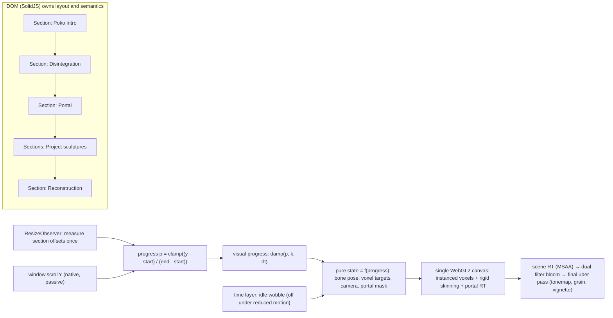

# Lusion: Deep Technical Analysis (research for POKO GENESIS)

> **Status:** research document, written 2026-10-09. It is not a specification of the POKO GENESIS app.
> **Main caveat:** `lusion.co`, `lusion.co/about/`, `webgl-scroll-sync.lusion.co`, `blog.lusion.co`, Codrops, Commarts, Awwwards, threejs.org, gsap.com and docs.blender.org were all **blocked by this sandbox's egress proxy** (HTTP 403 on CONNECT; Chromium reported `net::ERR_TUNNEL_CONNECTION_FAILED`). No production Lusion page was loaded in a browser, and no number in this document describes lusion.co's production bundle. What *was* examined directly:
> - Lusion's own open-source code (`lusionltd/WebGL-Scroll-Sync`, MIT). It was cloned, read line by line, served locally and measured with the capture script.
> - Edan Kwan's (Lusion founder) open-source GPGPU particle experiment `edankwan/The-Spirit` (MIT).
> - Primary-source library code and docs pulled from npm and git: three.js, GSAP, Lenis, glTF-Blender-IO, the glTF extension specs, gltfpack, and others.
> - First-party Lusion statements, reachable only as **search-result excerpts**. They are cited as such and treated as weaker evidence.

Companion documents:
[INTERACTION_ENGINEERING.md](./INTERACTION_ENGINEERING.md) ·
[WEBGL_RENDERING_TECHNIQUES.md](./WEBGL_RENDERING_TECHNIQUES.md) ·
[ASSET_PRODUCTION_WORKFLOW.md](./ASSET_PRODUCTION_WORKFLOW.md) ·
[REFERENCE_PERFORMANCE.md](./REFERENCE_PERFORMANCE.md) ·
capture tool: [`scripts/research/capture-reference.mjs`](../../scripts/research/capture-reference.mjs)

---

## 0. Key findings

| # | Finding | Evidence tier | Confidence |
|---|---|---|---|
| 1 | Lusion's published answer to "WebGL drifts behind native scroll" keeps the canvas **`position: absolute`**, not `fixed`. Every frame it is moved with `transform: translate(scrollX, scrollY − 0.25·vh)` and rendered **1.5× viewport height** (25% padding above and below). Visuals then stay attached to their DOM boxes between frames, *without* scroll-jacking. | E2 (source read) + E1 (measured DOM) | High |
| 2 | In that demo, the WebGL objects are positioned **in pixel space directly in the vertex shader** from `getBoundingClientRect()` data: an identity `THREE.Camera`, no projection matrix. There is one shared `PlaneGeometry(1,1)`, one `ShaderMaterial` per image, and manual pixel-space culling with `frustumCulled = false`. | E2 + E1 | High |
| 3 | The demo uses three.js **r161** (`three ^0.161.0` in `package.json`). The runtime confirmed revision `"161"` through the `__THREE_DEVTOOLS__` register event. It runs on **WebGL2**, with `antialias: true` and one program. It issues **0–7 draw calls per frame** (p50 = 3 while scrolling) and one `renderer.render()` per frame, with no post-processing. | E1 | High |
| 4 | The demo's main costs are pixel count and texture memory. On a 390×844 @3x emulation the drawing buffer was **1170×3798 = 4.4 MP** (uncapped DPR × 1.5 height). Eight 1024×1536 WebP textures (578 KB on the wire) expand to roughly **67 MB of RGBA8 + mipmaps in VRAM** (my calculation). | E1 + arithmetic | High |
| 5 | Lusion's documented production habit (2019 case study, via excerpt) is **baking**. Cloth simulated in Houdini is shipped as a 16-bit-integer `ArrayBuffer` (220 KB gzip). The rest is shipped as **vertex animation textures** (position + normal PNGs), in **device-tiered** variants: 4096 vertices / 983 KB on desktop, 1024 vertices / 246 KB on mobile. Only 11 of 66 keyframes are stored, and the rest are interpolated at runtime. | E3 (search excerpts of the Awwwards case study) | Medium |
| 6 | Edan Kwan's open-source GPGPU particles (The-Spirit, 2015) show the house style for GPU-driven motion: float position textures ping-ponged with **curl noise**; particle life in the alpha channel; shadows that match GPU-displaced geometry via `customDistanceMaterial`; and a hand-written post chain (bloom, motion blur, DOF, FXAA, vignette). | E2 | High (for that project) |
| 7 | The Lusion v3 site (2023, Awwwards Site of the Year) has an About-page astronaut that "evolves with the user's interaction". Scrolling leads it "through portals until … it breaks through the glass". This is the closest public analogue to POKO's "mascot → portal → reconstruction" arc. | E3 (Commarts quote via excerpt) | Medium |
| 8 | Accessibility in Lusion's open demo is weak in ways POKO should avoid. Images exist only in `<noscript>`, so with WebGL blocked the page shows empty frames and throws an uncaught error. Links have `outline: none`. Off-screen overlay links receive keyboard focus first. `prefers-reduced-motion` is ignored. | E1 | High (for the demo) |

Evidence tiers used throughout:
**E1** = measured by me in a browser.
**E2** = I read the actual source code.
**E3** = first-party statement (Lusion or its staff), seen only as a search-engine excerpt because the page was blocked.
**E4** = third-party commentary or reverse engineering.

Confidence: **High / Medium / Low**.

---

## 1. Method

1. **Reachability check (2026-10-09).** Every required URL was tried with `curl` through the sandbox proxy, with Playwright/Chromium 141, and with WebFetch (which resolves through the same sandbox). Results are in §2.
2. **Source acquisition through allowed channels.** The allowed channels were anonymous `git clone --depth 1` of public GitHub repos and `npm pack` of packages (tarballs extracted, never executed). The docs pages behind threejs.org/docs are generated from the three.js repo, so they were read from `mrdoob/three.js@43488e6` (`docs/pages/*.html.md`). The Blender manual's glTF page is maintained in `KhronosGroup/glTF-Blender-IO` (`docs/blender_docs/scene_gltf2.rst`).
3. **Browser reverse engineering.** `scripts/research/capture-reference.mjs` hooks `getContext`, every WebGL draw/bind/upload call, `requestAnimationFrame`, `addEventListener`, `Worker`, `WebAssembly` and three.js's `__THREE_DEVTOOLS__` hook. It records CDP network, performance metrics and a Chromium trace, and takes screenshots and video. Variants: desktop 1440×900, mobile 390×844 @3x with touch, `prefers-reduced-motion: reduce`, and WebGL blocked. Against lusion.co it could only record the block. It was then run against:
   - (a) a local, unmodified copy of Lusion's WebGL-Scroll-Sync demo, served by a small static server I wrote that mirrors Vite's `?raw` import and resolves `three` through an import map;
   - (b) a synthetic voxel benchmark I wrote, to validate the instancing and post-processing detection.
4. **Rendering caveat.** The container has no GPU, so WebGL ran on **SwiftShader** (`ANGLE (Google, Vulkan 1.3.0 (SwiftShader Device (Subzero)))`). All frame timings are relative only. See [REFERENCE_PERFORMANCE.md](./REFERENCE_PERFORMANCE.md).
5. **Secondary research.** About 20 WebSearch queries were run on Lusion talks, case studies, interviews, Labs, and GitHub. Search results return only short excerpts. Whenever this document relies on one, it says so.

---

## 2. Source access log

| Source | Channel tried | Result (2026-10-09) |
|---|---|---|
| https://lusion.co/ | curl, Chromium, WebFetch | **Blocked**: proxy 403 / `ERR_TUNNEL_CONNECTION_FAILED` / `ENOTFOUND` |
| https://lusion.co/about/ | curl, Chromium, WebFetch | **Blocked** (same) |
| https://github.com/lusionltd/WebGL-Scroll-Sync | `git clone --depth 1` | **OK**: commit `d2f2c84` (2025-04-04), MIT © 2025 Lusion Ltd |
| https://webgl-scroll-sync.lusion.co/ | curl, Chromium | **Blocked**, so the cloned source was served locally |
| https://www.commarts.com/project/36283/lusion | curl, WebFetch | **Blocked**; content known only from search excerpts |
| https://tympanus.net/codrops/2021/05/17/curly-tubes-from-the-lusion-website-with-three-js/ | curl, WebFetch | **Blocked**; search excerpts only (video tutorial, 2021-05-16 stream) |
| https://threejs.org/docs/ | curl, WebFetch | **Blocked**; the same pages were read from the three.js repo (`docs/pages`) and npm `three@0.186.1` |
| https://gsap.com/docs/v3/Plugins/ScrollTrigger/ | curl | **Blocked**; read `ScrollTrigger.js` from npm `gsap@3.15.0` instead |
| https://docs.blender.org/manual/en/latest/addons/import_export/scene_gltf2.html | curl | **Blocked**; read the page's source `scene_gltf2.rst` (glTF-Blender-IO `6e6990a`, add-on 5.3.36) |
| github.com/lusionltd (org listing) | GitHub MCP search | **OK**: 2 public repos (`WebGL-Scroll-Sync`, `ORYZO-1`) |
| blog.lusion.co, labs.lusion.co, exp-abduction.lusion.co | curl | **Blocked** |
| awwwards.com, thefwa.com, medium.com, dev.to, x.com, youtube.com, codepen.io, MDN, khronos.org | curl | **Blocked** |
| github.com/edankwan/The-Spirit | git clone | **OK** (MIT © 2015 Edan Kwan) |
| github.com/canxerian/lusion-reverse-engineered | git clone | **OK** (CC0; third-party recreation) |
| registry.npmjs.org | npm | **OK** |

---

## 3. What each source actually establishes

**Lusion's own code: WebGL-Scroll-Sync (E2/E1).** It is a single 300-line `main.js`, two shaders, and CSS. Three modes are switchable at runtime:

- "fixed with padding": absolute canvas, 25% padding;
- "fixed without padding": absolute canvas;
- "no fix": classic `position: fixed` canvas.

The README states the problem in one sentence: native scrolling "doesn't run on the same thread as `requestAnimationFrame`", so a fixed canvas that repositions objects from `scrollY` each rAF drifts when a scroll lands between frames. It adds: "drifting is visually disturbing but clipping isn't." Full walkthrough in [INTERACTION_ENGINEERING.md §4](./INTERACTION_ENGINEERING.md#4-webgl-scroll-sync-explained).

**The 2019 Lusion site case study on Awwwards (E3, via search excerpts).**

- Tools: "Houdini FX, Redshift3D, three.js, tweenlite, budo, webpack, less", with a Node static-site generator.
- Homepage cloth: pre-simulated in Houdini (a finger-like geometry dragged across the cloth in four directions). It is stored in one `ArrayBuffer` of 16-bit integers (not 32-bit floats), 220 KB gzip, and blended at runtime from user input.
- Animation data: "only 11 keyframes for the total 66 frames … interpolate the values in real-time".
- Contact scene: character cloth pre-computed in three directions, with position and normal data stored in two PNG textures (vertex animation). That is 983 KB on desktop at 4096 vertices versus 246 KB on mobile at 1024 vertices.
- A Lusion reply on the SideFX forum (also an excerpt) adds that the particle effects were "generated procedurally in WebGL", not baked in Houdini.

**Lusion v3, the current portfolio (E3/E4).** Commarts credits:

- Marco Grimaldi (design director);
- Edan Kwan (lead VFX artist and creative director);
- Marco Ludovico Perego and Anatole Touvron (VFX artists);
- Ffion Morgan (producer).

It describes the site as WebGL plus real-time 3D. On the About page, the astronaut "evolves with the user's interaction… Scrolling further leads the astronaut through portals until the end when it breaks through the glass", and there is "a playful astronaut protagonist that follows the user" and a fluid simulation at the bottom of the page. Awards listings: Awwwards Site of the Year 2023 and Developer Award; CSS Winner SOTD 2023-10-07. Third-party tags (Orpetron) list Three.js and TypeScript; the excerpts disagree on Netlify vs Angular, so the hosting and framework are unknown.

**Edan Kwan's writing and talks (E3).**

- His Medium post on *Lost in Parallel Universe*: a 2D fluid simulation ray-marched as a height field, with previous frames cached to fake a 3D volume. For mobile, a downscaled raymarcher with low sample counts plus procedurally generated blue noise. "three.js r124" is the only dependency, there are no model or texture files, and the code is about 60 KB excluding three. The post also covers WebGL1's 8-bit depth precision pain and size tricks such as minifying shaders and hashing three.js property names.
- Talks: Kikk 2023, Digital Design Days Milan 2024, and "Inside Lusion" at the first Three.js Conference, Paris, 2026-09-11, 14:30–14:55.
  - One search excerpt of the Codrops live recap says he showed how complex-looking visuals come from "optimized geometry, baked data, packed textures, and shaders". A second search could not find that passage, so treat it as **Low–Medium** confidence.
  - Muzli's recap calls the talk "a list of cheap tricks combined well".

**Other Lusion projects (E3/E4).**

- *My Little Storybook* (2021, Webby 2022), per Pauline Stichelbaut's case study excerpt: three.js; instancing for "grass, rocks, fishes, dust, shadows"; stylised Substance textures; a designer→developer export of post-processing settings, camera placements, characters and sprites, with interactive gizmos for placement.
- *Oryzo* (2026, Awwwards SOTM April 2026 plus Developer Award) has a 7-part BTS series. Parts 4–7, "WebGL/ThreeJS Tricks", were listed but **not yet published** when searched.
- *Surface Floater* (Google Experiments): SDF plus curl-noise physics around a model.
- *Abduction*: a GPGPU crowd simulation.

**Third-party reverse engineering (E4, Low confidence).**

- A dev.to post (DDW-X) claims a single-kernel "liquid glass" refraction+dispersion shader, a DOM↔WebGL layout layer ("ScrollDomRange"), and fBm camera shake (3 octaves × 6 DOF).
- `canxerian/lusion-reverse-engineered` (CC0) rebuilds the home page with three r166, Rapier physics and DOM-layout-to-3D mapping.

These are other people's interpretations. They are useful as hypotheses, not facts.

---

## 4. The 20 topics

Each topic is split into **Observation** (what was seen or measured, with method), **Hypothesis** (inference, with confidence) and **Lesson for POKO GENESIS**.

### 4.1 Composition and scene layout

**Observation.** In WebGL-Scroll-Sync, the DOM is the layout engine. Each `.image` div sets size and position with plain CSS (flex, `aspect-ratio: 1024/1536`, borders), and WebGL only *paints into* those boxes:
- `getBoundingClientRect()` runs once per resize;
- the result is converted to document coordinates by adding `scrollY`;
- it is passed as `u_domXY`/`u_domWH` uniforms.

DOM stacking, measured with `elementsFromPoint` at four points, is: text elements (static, auto z-index) → `#wrapper` (relative, `overflow:hidden`) → canvas at `z-index:-1`, `pointer-events:none`. So DOM text sits above WebGL with no special compositing.

**Hypothesis.** Lusion's production sites likely use the same "DOM decides layout, WebGL decorates" split for project tiles and text-adjacent effects, and a fully WebGL-owned stage for hero scenes such as the astronaut. Confidence: Medium. The third-party recreations independently converge on DOM-measured layout mapped into 3D (E4).

**Lesson for POKO.**
- Keep *document* layout in Solid/CSS: project titles, descriptions, links.
- Let WebGL own a **stage** whose 3D anchors come from DOM measurements taken on resize (ResizeObserver), never per frame.
- Each "act" of the narrative (Poko intact → disintegration → portal → sculptures → reconstruction) should be a tall DOM section whose measured `[start, end]` scroll range feeds a progress value (see INTERACTION_ENGINEERING §2).

### 4.2 Rendering architecture

**Observation.**
- The demo has one `WebGLRenderer` (WebGL2; requested attributes: `antialias:true, alpha:true, depth:true, stencil:true, powerPreference:"default"`), one `Scene`, and an identity `Camera`.
- It makes one `renderer.render()` per rAF, **every frame, even when nothing is visible**: 0 draw calls, a clear only, measured over 213 idle frames.
- Program count: 1 (8 `ShaderMaterial` instances share one compiled program because the sources are identical; `renderer.info.programs = 1`).
- No render targets, no framebuffer binds, no post-processing.
- In The-Spirit (Edan Kwan), the architecture is a custom `effectComposer` with Effect classes (bloom, motionBlur, dof, fxaa, vignette), plus an FBO simulation helper (`fboHelper.js`).

**Hypothesis.** Lusion's production engine is a custom three.js-based framework with its own composer and FBO helpers, not stock `EffectComposer`. Confidence: Medium, based on The-Spirit's architecture and the "custom assets everywhere" statement in the 2019 case study.

**Lesson for POKO.**
- One renderer and one canvas.
- A small render-graph abstraction of your own (scene pass → bloom → final uber-pass), so you control target formats and can skip passes on low tiers.
- Render on demand when idle (see 4.16).

### 4.3 Canvas positioning

**Observation (measured DOM, desktop).**

```
canvas#canvas  buffer 1440×1350, css 1440×1350, position:absolute, z-index:-1,
               transform: matrix(1,0,0,1,0,-225) at scrollY=0,
               pointer-events:none; parent div#wrapper {position:relative; overflow:hidden}
```

`-225 = -0.25 × 900`: the 25% top padding. On mobile emulation (390×844 CSS viewport, DPR 3): buffer 1170×3798, CSS 390×1266 (= 1.5 × 844), transform `translateY(-211px)` (= −0.25 × 844), `bufferToCssRatio = 3`. The scene graph is one `Scene` with 8 `Mesh` children and 8 `ShaderMaterial`s, all sharing 1 geometry (`renderer.info.memory.geometries = 1`, `textures = 8`). In "no fix" mode the canvas is `position:fixed; top:0`. With WebGL blocked, the canvas stays in its initial `html.no-fix` state because `init()` throws before the mode buttons are wired.

**Hypothesis.** Production lusion.co most likely uses a `position:fixed` full-viewport canvas with JS-driven ("virtual") smooth scroll. The README says award-winning sites "like our own at Lusion … seem to always be scroll-jacked". The open demo then represents their recommended *non*-jacked alternative. Confidence: Medium.

**Lesson for POKO.** If POKO keeps native scroll (recommended), use Lusion's absolute-canvas trick for anything that must stick to DOM boxes. For a single full-stage scene that doesn't track DOM boxes, a `fixed` canvas is fine: drift only matters when 3D objects must align with scrolling DOM elements. Cap the buffer (DPR ≤ 1.5–2 and pad only as much as you need).

### 4.4 Character animation strategies

**Observation.**
- No character exists in the open demo.
- The Spirit animates particles entirely on the GPU: positions live in a float texture, the simulation shader advects them with curl noise, and a vertex shader samples the texture by a per-vertex UV stored in `position.xy`.
- Lusion's 2019 statements (E3) describe **vertex animation textures**: positions and normals baked from Houdini into PNGs, 11 stored keyframes interpolated to 66 frames, and blending between pre-simulated directional variants by user input.

**Hypothesis.** The v3 astronaut that "follows the user" is a skinned glTF character driven by a state machine (idle, follow, look-at, through-portal), possibly with baked secondary motion (cloth/VAT). The "breaks through the glass" moment is probably a pre-fractured, baked or instanced shatter driven by scroll progress. Confidence: Low–Medium; it can't be verified while the site is blocked.

**Lesson for POKO.** Poko is voxels, so the cheapest robust approach is **rigid voxel skinning**:
- each voxel instance stores `boneIndex` plus its rest offset in bone space;
- the vertex shader multiplies by that bone's matrix, read from a small bone texture.

Animation is authored in Blender with an armature and exported as glTF actions. On the web, the actions are sampled at `t = f(progress)` (deterministic scrubbing) or played by `AnimationMixer` for idle loops. Bake to textures (VAT style) only for things a skeleton can't express (shatter, cloth). Details are in WEBGL_RENDERING_TECHNIQUES §2–3 and ASSET_PRODUCTION_WORKFLOW §2.

### 4.5 Camera paths

**Observation.** The demo has no perspective camera. It uses an identity `THREE.Camera`, and the vertex shader writes clip coordinates directly from pixels. A third-party analysis of Oryzo (E4) describes "a scroll that moves the camera through true Z-axis depth", plus physics-like easing on a single hero object.

**Hypothesis.** Lusion camera moves are authored (Houdini/Blender curves or keyframes) or computed as splines, parameterised by smoothed scroll progress, with a small procedural noise layer on top (the dev.to post claims fBm shake: E4, Low). Confidence: Medium for "progress-parameterised"; Low for specifics.

**Lesson for POKO.** Author the camera in Blender as an animated camera (or an empty plus a look-at target), export it with the scene, and scrub it by `progress`. Add idle "breathing" as a separate *time*-based layer whose amplitude fades to 0 under reduced motion. Never integrate camera velocity frame-to-frame; that breaks reversibility.

### 4.6 Scroll synchronization

**Observation (E2).**
- Native document scroll: `scrollingElement` is `html`; `body` has `overflow-x:hidden`, `overflow-y:auto`; nothing is hijacked.
- The only listener registered was a single `resize` on `window`: no `wheel`, `touchmove` or `scroll` listeners.
- Each rAF reads `window.scrollY`, computes `scrollDelta`, and moves the canvas with a transform. Shaders subtract `u_scrollOffset`.
- Keyboard scrolling (PageDown/Space/ArrowDown/End) worked natively and reached `scrollY = 4710` (the bottom).

**Hypothesis.** On lusion.co itself, scroll is virtualised, as the README implies about their own site. Confidence: Medium. The open demo shows they know how to avoid that when needed.

**Lesson for POKO.** Native scroll, a progress mapping computed from cached section offsets, and frame-rate-independent smoothing of the *visual* progress only (never of the scroll position itself). See INTERACTION_ENGINEERING.

### 4.7 Transition techniques

**Observation (E2).** The demo's only transition is a scroll-velocity "glitch":
- `strength` decays as `strength *= exp(-dt·10)` (frame-rate independent) and is bumped by `min(|Δscroll|·10/vh, 5)` (per frame, so it is frame-rate *dependent*);
- the fragment shader takes 5 samples along a random vertical UV offset (band-quantised with a hash) and brightens by `1 + 2·strength`;
- random seeds are refreshed with probability `1 − exp(−dt·25·(1+strength))` per frame, which is a proper Poisson process.

The-Spirit fades particles in through an `initAnimation` uniform that drives the follow target and respawn radius.

**Hypothesis.** The production portal and glass-break transitions combine render-to-texture of the "other side" with a masked, distorted composite (refraction), plus geometry shatter. Confidence: Low–Medium (E3 wording, E4 dev.to claim of a refraction/dispersion shader).

**Lesson for POKO.**
- Express every transition as a pure function `T(progress)`.
- For the portal, render the destination scene into a half-resolution render target only while the portal is on screen, and composite it through a disc/ring mask with a swirl.
- For disintegration, give each voxel a seeded delay (`smoothstep(seed·0.5, seed·0.5+0.5, p)`) so the effect ripples instead of happening all at once. Snippets are in WEBGL_RENDERING_TECHNIQUES §6.

### 4.8 Pointer interaction

**Observation.** The demo canvas has `pointer-events:none`, and no pointer listeners were registered. In The-Spirit, a `mouse3d` uniform is the follow target of the curl-noise particles: the pointer is projected into 3D on the CPU and passed to the simulation shader. Commarts (E3) says the astronaut "follows the user".

**Hypothesis.** The astronaut's follow behaviour is pointer (or touch) → ray → plane intersection → a damped target the character looks at or moves toward. Confidence: Medium.

**Lesson for POKO.**
- Keep the canvas `pointer-events:none`, listen on `window` with passive pointer events, and convert to NDC from the canvas rect.
- Raycast against **proxy geometry**: a sphere or box for Poko, or an analytic voxel-grid traversal. Raycasting 20k instances is wasteful.
- On touch, follow the last tap or drag point.

See INTERACTION_ENGINEERING §6.

### 4.9 Custom shader usage

**Observation.**
- Demo: 2 custom shaders, `img.vert` and `img.frag`. The fragment shader uses Dave Hoskins' `hash43` (credited in a comment), a 5-tap loop, and GLSL1-style `texture2D`/`gl_FragColor`. three's `ShaderMaterial` rewrites these for GLSL3 on WebGL2; my shader hook saw `#version 300 es` in both stages.
- The-Spirit: `RawShaderMaterial` simulation shaders; `simplexNoiseDerivatives4` and `curl4` helpers (glslify); custom depth/distance/motion-vector shaders.

**Hypothesis.** Lusion writes most materials as custom shaders, or as heavily patched built-ins, sharing chunks through a shader-include system (glslify in 2015–16; likely a bundler-based include now). Confidence: Medium–High.

**Lesson for POKO.**
- Start from `MeshStandardMaterial` + `onBeforeCompile` for PBR voxels, with `customProgramCacheKey`. This gives lighting, shadows and fog for free.
- Write raw shaders only for full-screen passes, the portal and particles.
- Keep GLSL in `.glsl` files imported as strings (Vite `?raw`, as Lusion's demo does).

### 4.10 Lighting and shadow

**Observation.**
- The demo is unlit (texture sample only).
- The-Spirit uses a point light with `castShadow = true` and gives each GPU-displaced mesh a `customDistanceMaterial` that samples the *same* position texture. Without this, three's shadow pass would render the undisplaced geometry.
- In the bench, `MeshStandardMaterial` + instancing compiled with `STANDARD` and `USE_INSTANCING` defines and ACES tone mapping.

**Hypothesis.** Lusion relies on baked lighting (Redshift/Houdini renders, stylised textures in Storybook) plus cheap real-time key lights and selective real-time shadows. Confidence: Medium (E3 tool lists; Storybook's "shadows" were instanced, i.e. fake blob/decal shadows).

**Lesson for POKO.**
- Use one directional key light with a tight shadow frustum around Poko, or skip real shadows and use a contact-shadow blob under Poko.
- Get ambient light from a PMREM'd `RoomEnvironment` (no HDR download).
- If displaced voxels must cast shadows, give the instanced mesh a `customDepthMaterial` with the same vertex displacement (WEBGL_RENDERING_TECHNIQUES §8).

### 4.11 Post-processing

**Observation.**
- Demo: none. Any glitch is applied per material.
- The-Spirit: bloom (separate bright-pass and blur shaders), motion blur (motion vectors from previous and current position textures), DOF, FXAA, and vignette, each its own `Effect`.
- The 2021 Storybook case study (E3) says the designers exported *post-processing settings* along with cameras.
- In my synthetic bench, three's `EffectComposer` + `UnrealBloomPass` + `OutputPass` produced **15 draws and 21 framebuffer binds per frame**:
  - the MSAA×4 half-float scene target;
  - a half-resolution bright pass;
  - 5 mip levels × (horizontal + vertical) Gaussian blurs at 720×450 down to 45×29;
  - a composite;
  - an additive copy back;
  - the output pass to screen.

**Hypothesis.** Lusion's chain is bloom + tone mapping + grain/vignette at minimum, likely with FXAA or SMAA on low tiers, and per-project specials (DOF, motion blur, refraction). Confidence: Medium.

**Lesson for POKO.**
- Use a dual-filter (Kawase-style down/up mip) bloom, which is cheaper than UnrealBloom's 10 separable blurs.
- Merge tone mapping, grain, vignette and the sRGB transfer into a single final pass.
- Use MSAA on the scene render target and disable `antialias` on the default framebuffer.

### 4.12 Geometry generation

**Observation.** Demo: one `PlaneGeometry(1,1,1,1)` shared by every image, scaled in the shader by the DOM size. The-Spirit builds particle geometry procedurally: points or "triangles", with lookup UVs in `position.xy`. The curly-tubes tutorial recreates Lusion's tubes in three.js (details in WEBGL_RENDERING_TECHNIQUES §11; the page itself was blocked).

**Hypothesis.** Lusion generates most decorative geometry procedurally at load time (tubes, particles, instanced props) and ships authored meshes only for hero assets. Confidence: Medium–High. Supporting evidence: the 2019 SideFX reply ("particle effects … generated procedurally in WebGL") and the 60 KB "no model files" experiment.

**Lesson for POKO.** Don't ship voxel meshes. Ship voxel *data* (positions + palette indices, a few bytes per voxel) and one cube geometry, and build `InstancedMesh` attributes at runtime. Sculptures for projects are just more voxel lists (or a `DataArrayTexture` of target formations).

### 4.13 Asset loading

**Observation (local harness, see REFERENCE_PERFORMANCE).**
- The demo loads 16 requests: 1 HTML, 2 CSS, 4 script modules (main, two shader `?raw` modules, three), 1 WOFF2 font, and 8 WebP textures.
- Every request started within the first second.
- Textures are requested by `TextureLoader` immediately at init (`/images/${i}.webp`), not lazily by visibility, and decoded on the main thread (8 `Decode Image` trace events totalling about 110 ms on this machine).
- Warm reload: 10 of 16 responses came from cache in this harness. This reflects *my* server's headers, not Lusion's hosting.

**Hypothesis.** Production Lusion sites use a preloader that gates entry on critical assets (the 2019 stack included Edan's `quick-loader`, an "asset loader that loads everything", per his GitHub) and lazy-load per-project media. Confidence: Medium.

**Lesson for POKO.**
- Use a two-phase load. Critical: the Poko voxel data, the skeleton/animation glb, and the env map generated in code. Deferred: project sculptures, loaded as soon as idle (`requestIdleCallback` / after first frame) and before their section is reached.
- Use `createImageBitmap` / `ImageBitmapLoader` to decode off the main thread where images are needed.

### 4.14 Model compression

**Observation.** No models in the open demo. E3: 2019 Lusion shipped cloth as 16-bit integers (quantisation) and VATs as PNG, with smaller mobile variants. Decoder sizes measured from `three@0.186.1/examples/jsm/libs`:

| Decoder | Raw | gzip -9 |
|---|---|---|
| meshopt (JS + embedded wasm) | 29 KB | 7.7 KB |
| Draco (wasm + wrapper) | 286 KB + 59 KB | 88 KB + 12 KB |
| Basis/KTX2 transcoder (wasm + JS) | 527 KB + 58 KB | 245 KB + 15 KB |

**Hypothesis.** Lusion favours custom binary formats and quantisation over general-purpose mesh codecs for hero data, because they control both ends. Confidence: Medium.

**Lesson for POKO.** Use `gltfpack -cc` (meshopt + quantisation) for the rig/animation glb: tiny decoder, and it also compresses animation. Use a custom quantised voxel binary for voxels. Skip Draco. Use KTX2 only if real textures appear. See ASSET_PRODUCTION_WORKFLOW.

### 4.15 Mobile adaptation

**Observation.**
- The demo has CSS breakpoints at 1024 px and switches to single-column layout.
- The JS does **not** adapt: `dpr = window.devicePixelRatio` is used uncapped, so the mobile buffer was 1170×3798 (4.44 MP, 2.3× the desktop's 1.94 MP).
- Under SwiftShader, mobile emulation ran at 3.5 fps versus 27 fps on desktop. That ratio is a relative signal only.

E3: Lusion's 2019 site shipped **separate, smaller mobile assets** (1024 vs 4096 vertices), and Edan's raymarcher downscaled with blue noise on mobile.

**Hypothesis.** Production Lusion sites tier quality by device class: asset LOD, resolution scaling, and effects switched off. Confidence: High that some tiering exists; Low for the specific heuristics.

**Lesson for POKO.**
- Define quality tiers (voxel count, DPR cap, shadow on/off, bloom resolution).
- Pick the initial tier from a cheap heuristic (`navigator.hardwareConcurrency`, screen size, `WEBGL_debug_renderer_info` if present).
- Then adapt at runtime from measured frame time (drop DPR in steps when p95 > budget for a few seconds).

### 4.16 Frame scheduling

**Observation.**
- The demo runs one perpetual rAF loop (exactly 1 rAF registration and 1 `render()` per frame) with no visibility or idle throttling.
- `dt` comes from `performance.now()`, and smoothing uses `exp(-k·dt)` (good).
- GSAP ScrollTrigger (read from source) updates synchronously inside `scroll` events unless `normalizeScroll` is on, in which case it batches into rAF.
- Lenis advances its damped value from rAF `deltaTime`.

**Hypothesis.** Lusion runs a single central ticker that updates simulation, animation and render in a fixed order. Confidence: Medium.

**Lesson for POKO.**
- Run one ticker in this order: read scroll → compute progress → smooth → update animation/state → render.
- Pause when `document.hidden`, and skip rendering when nothing changed (no scroll, no pointer, no time-based animation visible).
- Clamp `dt` (e.g. ≤ 1/20 s) so tab switches don't cause jumps.

### 4.17 GPU resource management

**Observation.**
- Demo: 8 textures (`renderer.info.memory.textures = 8`), 1 geometry, 1 program; `createTexture` called 12 times.
- `texStorage2D` + `generateMipmap` × 8: three allocates immutable storage with mips for each 1024×1536 texture, about 8.4 MB each with mips.
- Nothing is ever disposed, which is fine for a single page.
- Bench: `EffectComposer` clones its render target, so MSAA storage is allocated twice. Four `renderbufferStorageMultisample` calls were recorded (color + depth × 2 targets).

**Hypothesis.** Lusion disposes per-page or per-project resources on route change, since their sites are SPAs with project pages. Confidence: Medium.

**Lesson for POKO.**
- Budget VRAM explicitly: voxel instance buffers, the bone texture, post targets.
- Avoid MSAA on more than one target.
- Call `dispose()` on sculptures that won't be revisited (or keep them pooled if the user can scroll back).
- Handle `webglcontextlost`/`restored`.

### 4.18 Browser compatibility

**Observation.**
- Demo: requires WebGL (three ≥ r163 dropped WebGL1 entirely; r161 already defaults to WebGL2).
- With `getContext` returning `null`, three logs `THREE.WebGLRenderer: Error creating WebGL context.` and the page throws an uncaught `Error`. There is no fallback, and image boxes stay empty because the ``s exist only inside `<noscript>`.
- Extensions three queried on this machine: `EXT_color_buffer_float`, `EXT_color_buffer_half_float`, `OES_texture_float_linear`, `WEBGL_multisampled_render_to_texture`, `KHR_parallel_shader_compile`, `EXT_texture_filter_anisotropic`, `WEBGL_clip_cull_distance`.

**Hypothesis.** Production Lusion shows a fallback or "experience unavailable" state for no-WebGL. Unverified.

**Lesson for POKO.**
- Wrap renderer creation in `try/catch`.
- Render a static, complete HTML version: real ``s or `<picture>` of Poko and each project, with alt text. The WebGL layer is a progressive enhancement over it.
- Feature-detect `EXT_color_buffer_float` only if float render targets are needed; half float is enough for bloom.

### 4.19 Performance bottlenecks

**Observation (relative, SwiftShader).**

| Variant | Frame rate |
|---|---|
| Demo, desktop idle (0 draws) | 53 fps |
| Demo, desktop scrolling (3 draws, glitch loop of 5 texture taps over large quads) | 16 fps |
| Demo, mobile @3x | 3.5 fps |
| Demo, no WebGL | 59.8 fps, 0 long tasks |

So the cost is almost entirely **fill rate (pixels × taps)**, not JS: `FireAnimationFrame` p50 = 0.22 ms.

In the bench, CPU-updating 8,000 instance matrices per frame uploaded **512,000 B/frame** and doubled rAF script time (p50 0.47 ms vs 0.23 ms for the GPU-driven variant). Rendering cost was identical, since SwiftShader dominates.

**Hypothesis.** Lusion's bottlenecks are fill rate (full-screen effects at high DPR) and shader compile stalls at scene entry. Confidence: Medium.

**Lesson for POKO.**
- Fill rate is the budget: cap DPR, run post at reduced resolution, and avoid large overdraw from transparent voxels (use dithered or hashed alpha).
- Pre-compile programs (`renderer.compileAsync(scene, camera)`) during the loader.
- Keep per-frame uploads to a few small uniforms.

### 4.20 Accessibility

**Observation (demo).**
- `lang="en"` and one `h1`, but an `h2` (inside the hidden overlay) precedes it in DOM order.
- No `main` or `nav` landmarks.
- Keyboard focus visits 5 overlay links that are off-screen (`transform: translateY(-100%)`) before reaching the visible "GitHub" link. `focusVisible` was true but the computed outline was `none 0px` (CSS sets `a { outline: none }`), so focus is invisible.
- `prefers-reduced-motion: reduce` produced no behaviour change: screenshot diffs vs normal were ≤ 0.2 mean abs, i.e. just random glitch noise.
- No-WebGL: content images missing, with an uncaught error.
- Native scroll and keyboard scroll work, which is the main positive.

**Hypothesis.** Production Lusion sites, being scroll-jacked, likely have similar gaps (find-in-page, anchors, keyboard scroll). Unverified.

**Lesson for POKO.**
- Semantic HTML first: one `h1`, `main`, project sections with headings, real links.
- Visible `:focus-visible` styles; `inert` on hidden overlays.
- A reduced-motion mode that replaces disintegration and portal travel with crossfades and disables smoothing and idle motion.
- A complete no-WebGL fallback.
- The canvas gets `aria-hidden="true"`, with the narrative carried by DOM text.

---

## 5. POKO GENESIS reference architecture (derived)



## 6. Verification checklist for when lusion.co is reachable

Run `node scripts/research/capture-reference.mjs <outDir>` (defaults to lusion.co home + about) on a machine with a GPU and normal egress, then check:

1. `page.contexts`: WebGL vs WebGL2, `antialias`, `powerPreference`.
2. `three.revisions`, or a bundle signature `three:REVISION`: the three.js version.
3. `dom.scroll`: `html/body overflow`, tall `transform`ed wrappers, wheel listeners with `passive=false` (virtual scroll vs native).
4. `passSamples`: render-target sizes and order, giving the post chain.
5. `bodies.models`: glTF `extensionsUsed` (Draco/meshopt/KTX2/quantization) and `asset.generator`.
6. `network.byExt` / `cacheControl`: formats and caching.
7. `nowebgl` and `reduced` variants: fallback and reduced-motion behaviour.

---

## Sources

All accessed 2026-10-09. "Blocked" means not reachable from this sandbox; such content was used only via search-result excerpts.

- Lusion home: https://lusion.co/ (blocked)
- Lusion about: https://lusion.co/about/ (blocked)
- Lusion WebGL-Scroll-Sync repo (cloned, commit d2f2c84, MIT © 2025 Lusion Ltd): https://github.com/lusionltd/WebGL-Scroll-Sync
- WebGL-Scroll-Sync live demo: https://webgl-scroll-sync.lusion.co/ (blocked; served locally from clone)
- Lusion GitHub org (2 public repos): https://github.com/lusionltd ; ORYZO-1 (parody "open-weight coaster" OBJ files, MIT): https://github.com/lusionltd/ORYZO-1
- Commarts, Lusion v3: https://www.commarts.com/project/36283/lusion (blocked; excerpts)
- Commarts webpick (Kwan Q&A, "all WebGL scenes were powered by ThreeJS"): https://www.commarts.com/webpicks/lusion (excerpts)
- Awwwards case study, 2019 Lusion site: https://www.awwwards.com/case-study-for-lusion-by-lusion-winner-of-site-of-the-month-may.html (blocked; excerpts)
- Lusion on X, Houdini making-of (2019-06-17): https://x.com/lusionltd/status/1140604998138650625 (excerpts)
- SideFX forum "Houdini to Three.js": https://www.sidefx.com/forum/post/286500/ (excerpts)
- Edan Kwan, "Lost in Parallel Universe" (Medium): https://medium.com/@edankwan/lost-in-parallel-universe-dba640efd39a (blocked; excerpts)
- Edan Kwan, The-Spirit (cloned, MIT © 2015): https://github.com/edankwan/The-Spirit
- Kikk 2023 talk: https://2023.kikk.be/kikk-for-pro/conferences/edan-kwan (excerpts)
- Three.js Conference Paris schedule: https://threejs.paris/schedule ; Codrops recap: https://tympanus.net/codrops/2026/09/10/inside-the-first-three-js-conference-in-paris/ ; Muzli recap: https://medium.muz.li/three-js-threw-its-first-conference-the-best-thing-on-stage-was-a-button-muzli-blog-8553d4cdd83a (all excerpts)
- Codrops studio profile (2026-04-13): https://tympanus.net/codrops/2026/04/13/lusion-where-digital-craft-meets-ambitious-experimentation/ (excerpts)
- Codrops, Curly Tubes from the Lusion Website: https://tympanus.net/codrops/2021/05/17/curly-tubes-from-the-lusion-website-with-three-js/ (blocked; excerpts)
- Lusion blog, Oryzo BTS: https://blog.lusion.co/oryzo-bts-part-1-7-concept-and-creative-direction , https://blog.lusion.co/oryzo-bts-part-3-7-website-ux-ui-and-illustrations (blocked; excerpts)
- My Little Storybook case study (Pauline Stichelbaut): https://medium.com/@PaulineStich/case-study-my-little-storybook-6f4293db9aba (excerpts)
- CSS Winner Lusion v3: https://www.csswinner.com/details/lusion-v3/17531 ; Orpetron Lusion v3: https://orpetron.com/sites/lusion-v3/ (excerpts)
- Utsubo, Best Three.js websites 2026 (third-party): https://www.utsubo.com/blog/best-threejs-websites-2026 (excerpts)
- DDW-X, "Deconstructing Lusion.co" (third-party, low confidence): https://dev.to/ddw-x/deconstructing-lusionco-how-i-reverse-engineered-the-most-awarded-webgl-site-on-the-internet-4c46 (excerpts)
- canxerian/lusion-reverse-engineered (cloned, CC0, third-party): https://github.com/canxerian/lusion-reverse-engineered
- three.js docs (read from repo `docs/pages`, commit 43488e6): https://threejs.org/docs/ ; three.js manual "Multiple Canvases, Multiple Scenes": https://threejs.org/manual/#en/multiple-scenes
- GSAP ScrollTrigger docs: https://gsap.com/docs/v3/Plugins/ScrollTrigger/ (blocked; source read from npm gsap@3.15.0)
- Blender manual, glTF 2.0: https://docs.blender.org/manual/en/latest/addons/import_export/scene_gltf2.html (blocked; source read from https://github.com/KhronosGroup/glTF-Blender-IO `docs/blender_docs/scene_gltf2.rst`)
